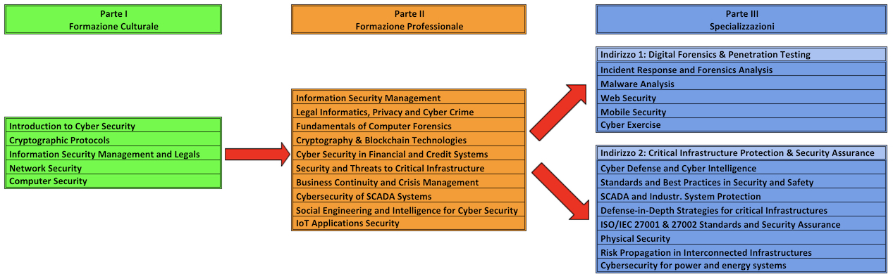

Il Master si contraddistingue per un approccio innovativo alla formazione, che coniuga il rigore e la sistematicità della docenza accademica con l'esperienza sul campo e il pragmatismo della docenza aziendale e professionale.
 
 
Il programma è articolato nei seguenti moduli didattici:

## Parte I - Formazione Culturale

1. Introduction to Cybersecurity
1. Cryptographic Protocols
1. Information Security Management and Legals
1. Network Security
1. Computer Security

## Parte II - Formazione Professionale

1. Information Security Management
1. Legal Informatics, Privacy and Cyber Crime
1. Fundamentals of Computer Forensics
1. Cryptography & Blockchain Technologies
1. Cybersecurity in Financial and Credit Systems
1. Security and Threats to Critical Infrastructure
1. Business Continuity and Crisis Management
1. Cybersecurity of SCADA Systems
1. Social Engineering and Intelligence for Cybersecurity
1. IoT Applications Security

## Parte III - Specializzazioni 

### Indirizzo 1: Digital Forensics & Penetration Testing
1. Incident Response and Forensics Analysis
1. Malware Analysis
1. Web Security
1. Mobile Security
1. Cyber Exercise

### Indirizzo 2: Critical Infrastructure Protection & Security Assurance
1. Cyber Defense and Cyber Intelligence
1. Standards and Best Practices in Security and Safety
1. SCADA and Industrial System Protection
1. Defense-in-Depth Strategies for critical Infrastructures
1. ISO/IEC 27001 & 27002 Standards and Security Assurance
1. Physical Security
1. Risk Propagation in Interconnected Infrastructures
1. Cybersecurity for power and energy systems
 
---

